

  

  <strong>A compact macOS interface to your own agent.</strong> 
  Ask a question. Put it to work. Keep your choice of models and providers.

  <code>macOS 13+</code> &nbsp; <code>Oh-my-pi</code> &nbsp; <code>Rust + Tauri</code> &nbsp; <code>MIT</code>

  <a href="#get-started">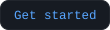</a>
  &nbsp;
  <a href="#use-null">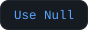</a>
  &nbsp;
  <a href="#privacy-and-permissions">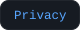</a>
  &nbsp;
  <a href="#under-the-hood">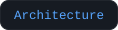</a>
  &nbsp;
  <a href="#development">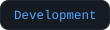</a>

  

  

  <a href="https://github.com/can1357/oh-my-pi">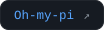</a>

  

  <a href="https://rustup.rs/">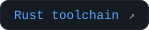</a>
  &nbsp;
  <a href="https://v2.tauri.app/start/prerequisites/#macos">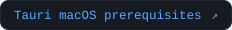</a>

  

  

  

  

  

  

  

  

  

  

  <a href="Mini/Page/index.html">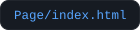</a>
  &nbsp;
  <a href="Mini/src/harness.rs">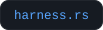</a>
  &nbsp;
  <a href="Mini/src/engine.rs">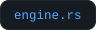</a>
  &nbsp;
  <a href="Mini/src/translate.rs">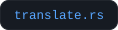</a>
  &nbsp;
  <a href="Mini/src/markdown.rs">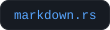</a>
  &nbsp;
  <a href="Mini/src/panel.rs">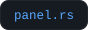</a>
  &nbsp;
  <a href="Mini/src/settings.rs">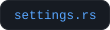</a>
  &nbsp;
  <a href="Mini/src/check.rs">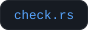</a>

  

  

  

  <a href="https://github.com/jamiepine/voicebox">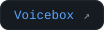</a>
  &nbsp;
  <a href="Context/ADR/0002-NullMiniIsItsOwnApp.md">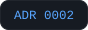</a>

  

  <a href="https://bun.sh">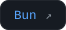</a>
  &nbsp;
  <a href="https://github.com/casey/just">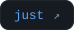</a>
  &nbsp;
  <a href="Context/Research/Research.md">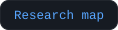</a>

  

  

  <a href="Context/Plans/CapitalFolders.md">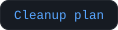</a>
  &nbsp;
  <a href="Context/ADR/0001-CapitalizedFolderNames.md">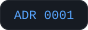</a>

  

  <a href="Context/Plans/MiniApp.md">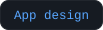</a>
  &nbsp;
  
  &nbsp;
  <a href="Context/Plans/OwnHarness.md">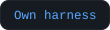</a>
  &nbsp;
  <a href="Context/Plans/ConversationDisplay.md">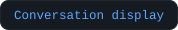</a>
  &nbsp;
  <a href="Context/Plans/NullMini.md">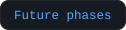</a>
  &nbsp;
  <a href="Context/ADR/">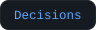</a>
  &nbsp;
  

  

  
  &nbsp;
  
  &nbsp;
  
  &nbsp;
  

